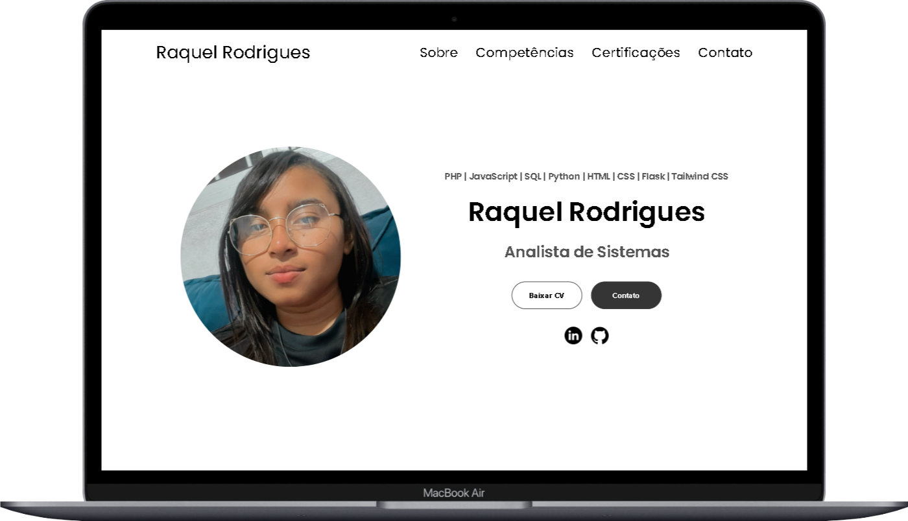

# Raquel Stefany - Portfólio

Criei este portfólio com o objetivo de apresentar de forma mais abrangente as minhas habilidades. Nele, você poderá encontrar exemplos concretos do que aprendi até agora e das minhas experiências.

### ⭐ Redes Sociais

          
    
             
     

